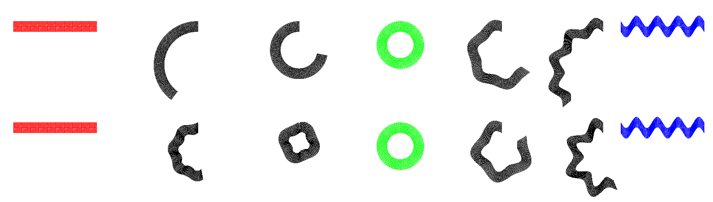
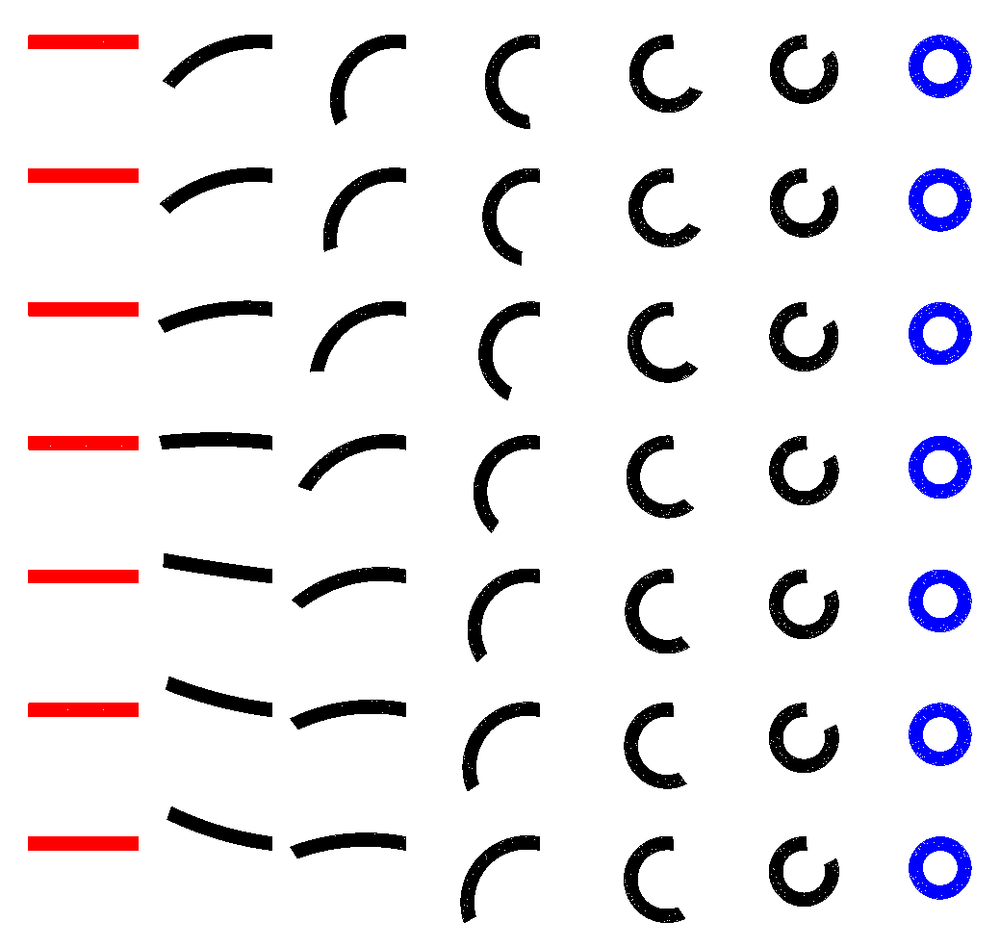

# AnimMorph

## Intro
Project for Professor Justin Solomon's MIT class, Shape Analysis (6.838).

Implementation of Chen, Weber, Keren, and Ben-Chen's paper, "Planar Shape Interpolation with Bounded Distortion" with some contributions.

In this project, I explore the possibilities of using typical interpolation and spline methods in the context of shape interpolation.

In the above screenshot, I show a comparison between Chen, et al's interpolation of a mesh (top) between three keyframes (red, green, and blue) and my natural cubic based interpolation (bottom).

Above we see a bezier interpolation between two meshes, and ways this interpolation may be changed using the bezier control points.

## Todo
* Clean up CMake (what is the proper way to import libraries?)
* Wrap up shape morphing code into a library
* Add toggleable 2D mode to Camera
* Would be nice if we shared libraries with my other project (e.g., Camera, Mouseable, etc. were copy pasted from elsewhere)
* Separate window logic from loop logic
* Texturing
* Convert texture to mesh
* Separate topology representation from Mesh class
* Clean up Shape morph code
	* Optimizations?
		* For instance, all topological math can be done only once.
		* Profiling (memory and time)
* UI
	* Improve mesh posing
	* Add handles for editing the Bezier motion
	